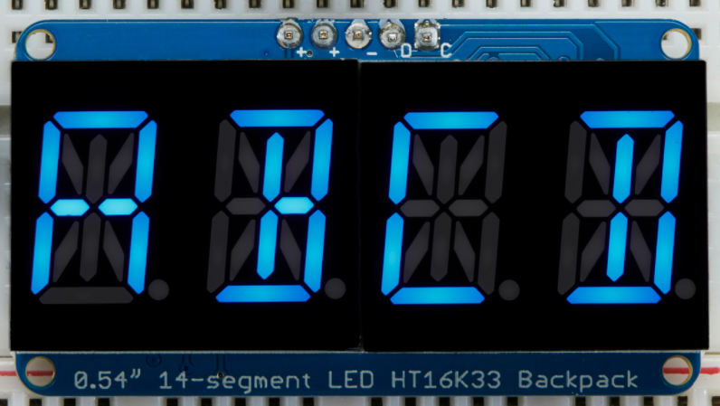
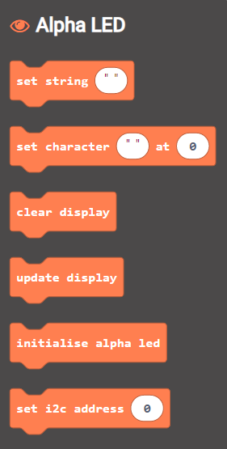

# Microbit Makecode Extension for the Adafruit 14-Segment Aphanumeric display
This block will work with the display with the [I2C interface](https://www.adafruit.com/product/1912)

> Open this page at [https://lewfer.github.io/tcl-mb-alpha-led-display/](https://lewfer.github.io/tcl-mb-alpha-led-display/)

## Use as Extension

This repository can be added as an **extension** in MakeCode.

* open [https://makecode.microbit.org/](https://makecode.microbit.org/)
* click on **New Project**
* click on **Extensions** under the gearwheel menu
* search for **https://github.com/lewfer/tcl-mb-alpha-led-display** and import

## Edit this project 

To edit this repository in MakeCode.

* open [https://makecode.microbit.org/](https://makecode.microbit.org/)
* click on **Import** then click on **Import URL**
* paste **https://github.com/lewfer/tcl-mb-alpha-led-display** and click import

## Blocks preview

